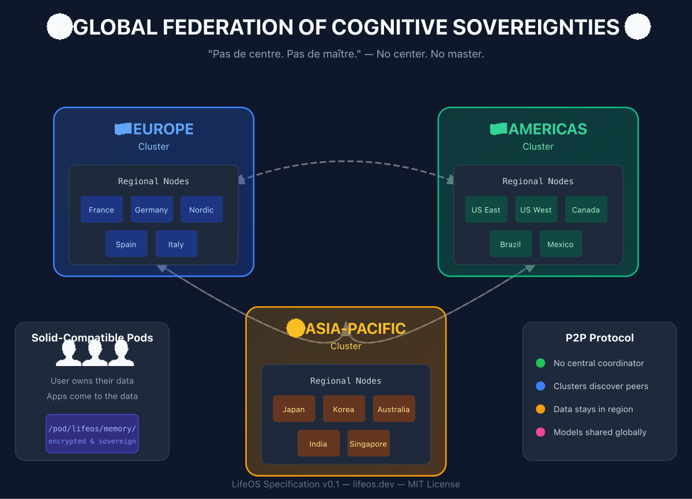

# LifeOS Specification

> **A presence-oriented cognitive architecture grounded in symbolic reasoning and augmented by selective, accelerated intelligence.**

[](https://opensource.org/licenses/MIT)
[](./spec/00-overview.md)
[](https://doi.org/10.5281/zenodo.18028496)

---

## 📖 Abstract

**LifeOS** is a formal specification for building cognitive systems that preserve human authority over memory, interpretation, and action. It defines a normative architecture composed of:

- A **cognitive kernel** enforcing the law `Presence × Memory × Action`
- **Memory subsystems** (STM/MTM/LTM) with intentional consolidation
- **SenseMaking** as a computable interpretive object
- **Harmonia**, the cognitive orchestration layer transforming intent into coordinated agent proposals under the **Double Lock** governance mechanism
- **Distributed infrastructure** principles for federated, sovereign deployment

This specification is implementation-agnostic and designed to support academic research, regional infrastructure projects, and sovereign AI initiatives.

---

## 🌍 Vision

LifeOS is not another AI assistant. It's a **specification** for building cognitive systems that:

- **Remember** with intention, not accumulation
- **Think** alongside humans, not instead of them
- **Act** only with explicit human authorization
- **Distribute** power across a global federation, not centralize it

```
"Pas de centre. Pas de maître."
"No center. No master."
```

---

## 🧠 Architectural Vision

LifeOS explicitly separates **symbolic reasoning** from **perceptual and interpretative intelligence**.

| Layer | Nature | Role |
|-------|--------|------|
| **Symbolic reasoning** | Deterministic, explainable, lightweight | Operates on structured facts, relationships, and rules (W3C / Solid-aligned) |
| **Perceptual intelligence** | Probabilistic, multimodal, compute-intensive | Invoked selectively to generate meaning, summaries, and presence |

**LifeOS does not conflate logic and intelligence.**

- Logic grounds decisions
- Intelligence augments meaning

This separation enables sovereign deployment: symbolic layers run anywhere, neural acceleration is invoked only when needed and authorized.

### Explainability by Design

LifeOS is an **Explainable Web** system — not merely Explainable AI.

| Approach | Explains |
|----------|----------|
| **XAI** (Explainable AI) | A model's outputs |
| **Explainable Web** | A system's decisions |

Facts, relations, and decisions remain **inspectable and attributable** across all layers:

- **What** was decided (action trace)
- **Why** it was decided (SenseMaking frame)
- **Who** authorized it (Double Lock audit)
- **When** and under what presence state

> *LifeOS extends the Web from explainable data to explainable decisions.*

---

## 📐 What is this repository?

This is the **formal specification** of LifeOS — like an RFC for cognitive architecture.

| What it IS | What it is NOT |
|------------|----------------|
| A specification anyone can implement | A product you can download |
| A philosophy made computable | A startup pitch |
| Open standards for cognitive sovereignty | A GAFAM competitor |
| A blueprint for regional infrastructure | A centralized platform |

---

## 🏗️ Architecture Overview



> *Vector version: [SVG](assets/global-federation.svg)*

---

## 📚 Specification Index

| Document | Description |
|----------|-------------|
| [00-overview](./spec/00-overview.md) | High-level architecture |
| [01-kernel](./spec/01-kernel.md) | Presence × Memory × Action — the core law |
| [02-memory-os](./spec/02-memory-os.md) | Memory architecture (STM/MTM/LTM) |
| [03-sense-making](./spec/03-sense-making.md) | SenseMaking as computable object |
| [04-harmonia](./spec/04-harmonia.md) | Cognitive orchestration layer |
| [05-solid-bridge](./spec/05-solid-bridge.md) | Integration with Solid Protocol |
| [06-federation](./spec/06-federation.md) | P2P distributed infrastructure |
| [07-agents](./spec/07-agents.md) | Agent architecture & governance |

---

## 🎯 See It In Action

> *"Show me one complete path through the system."*

**[Intent to Action: A Complete Trace](./examples/intent-to-action.md)** — Follow a single human intention from emergence to resolution, through every layer of LifeOS.

---

## 🔑 Core Principles

### 1. Presence Loop — The Sovereign Authority

> No memory, no action, no agent operates without stable human presence.

```
Presence Loop
    ↓ authorizes
MemoryOS
    ↓ feeds
Agent Orchestration
    ↓ proposes
ActionOS
    ↓ executes
Reality
```

**No arrow goes back up without passing through Presence Loop.**

### 2. SenseMaking — The Computable Process

> Transform fragmented signals into meaningful structure, with traceable interpretive decisions.

```
SCANNING → NOTICING → INTERPRETING → DECIDING → ENACTING
    ↑                                              │
    └──────────────── feedback ────────────────────┘
```

### 3. Double Lock — Cognitive Flow

> AI proposes. Human decides. Twice.

| Lock | Name | Question |
|------|------|----------|
| 1 | Cognitive | "What is this, really?" |
| 2 | Authorization | "Do you want me to execute?" |

### 4. Water Model — Infrastructure Financing

> Like water or electricity: essential public service, regional infrastructure, financed by usage.

```
User ─── subscription ───► Regional Cluster ───► Local reinvestment
  ◄─── cognitive services ────────────────────────────────────────┘
```

---

## 🤝 Related Projects

| Project | Relationship |
|---------|--------------|
| [Solid](https://solidproject.org/) | Data sovereignty protocol — LifeOS is Solid-compatible |
| [HuggingFace](https://huggingface.co/) | Model registry inspiration |
| [IPFS](https://ipfs.io/) | Distributed storage layer option |

---

## 🚀 Getting Started

### For Readers
Start with [00-overview](./spec/00-overview.md), then read based on interest.

### For Implementers
See [lifeos-starter](https://github.com/ivan-berlocher/lifeos-starter) (coming soon) for a minimal reference implementation.

### For Contributors
1. Read the [Philosophy](./PHILOSOPHY.md)
2. Open an issue for discussion
3. Submit PRs for spec improvements

---

## 📜 License

MIT License — Build freely, attribute kindly.

---

## � Citation

If you use LifeOS in academic work, please cite:

```bibtex
@software{berlocher2025lifeos,
  author       = {Berlocher, Ivan},
  title        = {{LifeOS: A Distributed Cognitive Architecture for Human Sovereignty in the Age of AI}},
  year         = {2025},
  version      = {v0.1},
  publisher    = {Zenodo},
  doi          = {10.5281/zenodo.18028496},
  url          = {https://github.com/ivan-berlocher/lifeos-spec}
}
```

---

## �👤 Author

**Ivan Berlocher** — Building cognitive sovereignty, one spec at a time.

> *"Papa est là pour leur montrer que l'on redeviendra maître de nos données, idées."*

---

*"Think different. Just do it."*
