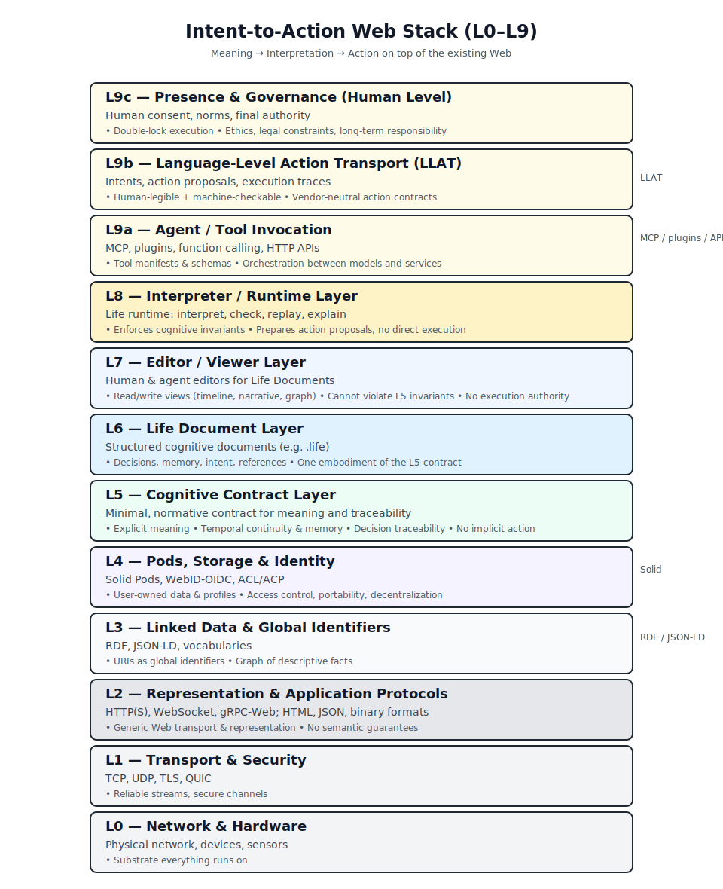

# 08 — LLAT: Language‑Level Action Transport

> **From natural language intent to auditable action, on the Web stack.**

**Version**: 0.1  
**Status**: Exploratory Draft (Non‑W3C)  
**Last Updated**: 2025-12-24

> This document is written for Web architects (including Tim Berners‑Lee and the W3C community).  
> Earlier documents in this repository use the name "LifeOS" for one concrete system.  
> This draft abstracts to the *Intent‑to‑Action Web* as a general architectural target.

---

## 1. Purpose & Audience

The Web stack today takes us from **IP packets** to **documents and data**.
What is missing is a **standard way to carry human‑authorized actions**, end‑to‑end, in a way that is:

- Layered on top of existing W3C / IETF standards
- Explicitly **human‑in‑the‑loop** (no silent autonomy)
- **Auditable** and **portable** across implementations and vendors
- Compatible with **Solid pods**, **RDF/JSON‑LD**, and emerging **agent/tool protocols** (e.g. MCP)

**LLAT (Language‑Level Action Transport)** is an architectural proposal for:

- A **logical Layer 7/8** above today’s application protocols
- A way to represent **intents, proposed actions, and execution traces**
- A minimal set of concepts that any Web‑native agent ecosystem can share

This document is **not** a formal W3C specification. It is written in a W3C‑compatible style to make a future standards track possible.

---

## 2. Layered Model (L0 → L9)

The Intent‑to‑Action Web can be described as a stack of layers.
The goal is to be **as clear as TCP/IP → HTTP → HTML**, but for **intent and action**.

**Figure 1 — Intent‑to‑Action Web Stack (L0–L9).**  
Rendered diagram available as SVG in this repository:
- `assets/llat-layers-l0-l9.svg` (source, preferred)
- `assets/llat-layers.png` (earlier L0–L8 export, kept for legacy slide decks)

### 2.1 Roles of L7 and L8

- **L7 (LLAT)**: defines *what it means*, on the Web, to say:
  - "This is the human’s intent"
  - "These are the concrete actions being proposed"
  - "This is the exact trace of what was executed and why"
- **L8 (Presence & Governance)**: defines *who is responsible*:
  - How human consent is obtained and logged
  - How emergency / standing authorizations are expressed
  - How conflicts of norms (privacy, safety, duty of care) are surfaced

L7 can be standardized as a **machine‑readable schema and protocol**.  
L8 is more about **governance frameworks**, yet must still be represented in a portable way (e.g. policies, agreements, legal/ethical constraints).

---

## 3. Core LLAT Concepts (Informal)

LLAT aims to standardize a small set of **core objects** that any agent/tool ecosystem on the Web should agree on.

> Names and structures below are *illustrative* rather than normative.

### 3.1 Intent

An **Intent** is a structured representation of what the human is trying to achieve.

Key properties:

- `origin`: who expressed it (human identity, device, context)
- `surface_form`: natural language / multimodal form (for logging)
- `interpreted_goal`: normalized, machine‑oriented goal description
- `constraints`: timing, reversibility, risk constraints
- `alignment_context`: which values/goals/preferences this intent touches

### 3.2 Action Proposal

An **ActionProposal** is a concrete, bounded suggestion for changing the world.
In LLAT, proposals are:

- **Typed**: they reference known action schemas (e.g. "SendEmail", "MoveFunds", "UpdateCalendarEvent")
- **Scoped**: they declare exactly which resources they may touch
- **Reversible‑aware**: they carry a reversibility flag and recovery strategy
- **Explainable**: they attach a short rationale and relevant evidence URIs

### 3.3 Execution Trace

An **ExecutionTrace** is an append‑only record of what actually happened:

- Which proposals were accepted/rejected/modified
- Which concrete tool calls were made (HTTP requests, MCP calls, etc.)
- Which resources were read/written, with hashes/pointers for audit
- Which authorizations (human, delegated, emergency) were in force

This trace must be **portable between implementations** and **inspectable by the user** (and, where appropriate, regulators and auditors).

---

## 4. Relationship to Existing Web & Solid Work

LLAT is **intentionally conservative**:

- It assumes **existing Web transport** at L0–L2 (IP, TLS, HTTP, WebSocket).
- It assumes the **Linked Data Web** at L3 (RDF/JSON‑LD).
- It assumes **Solid‑style pods** and **WebID‑based identity** at L4.
- It assumes a **personal knowledge layer** at L5 (but does not standardize the internal reasoning algorithms).

LLAT focuses specifically on:

- The **boundary** between L5 (personal context) and L6 (agent/tool invocation)
- A **vendor‑neutral, Web‑native vocabulary** for intents, proposed actions, and execution traces

As a useful analogy:

> HTML standardised how documents are displayed.  
> .life standardises how documents carry meaning, memory, and responsibility.

Solid remains the **data substrate**; LLAT aims to be the **action substrate**.

---

## 5. MCP Integration (Non‑normative)

> This section is non‑normative. It explains how the **Model Context Protocol (MCP)** can serve as part of the **L6 Agent / Tool layer** beneath LLAT.

### 5.1 MCP in the Layer Model

Within the L0–L8 model above:

- MCP is an **L6 protocol** for **describing tools** and **invoking them** from a model‑centric runtime.
- LLAT is an **L7 schema and contract** that sits *above* MCP and similar systems.

Analogy:

- **HTTP** carries requests and responses; **HTML** defines the document structure.
- **MCP** carries tool descriptions and calls; **LLAT** defines the *intent/action structure* across tools and vendors.

### 5.2 Mapping MCP Concepts to LLAT

Non‑normative mapping (illustrative):

- MCP "tool" manifest → LLAT **ActionSchema** candidate
- MCP "call" (with arguments) → one **ActionProposal.executionStep**
- MCP "session" / "connection" → part of the **ExecutionTrace.transport** layer
- MCP "resources" (files, logs, etc.) → linked via **ExecutionTrace.evidence** URIs

Under LLAT, an MCP‑based system would:

1. Interpret human input into an LLAT **Intent**.
2. Plan one or more LLAT **ActionProposals** using available MCP tools.
3. Execute those proposals via MCP calls, while writing a canonical LLAT **ExecutionTrace**.
4. Store that trace (and relevant artifacts) in user‑controlled storage (e.g. Solid pods).

### 5.3 Non‑Goals

LLAT does **not**:

- Standardize the internal behavior of MCP servers or clients.
- Prefer MCP over other mechanisms (HTTP APIs, gRPC, platform‑specific plugins).
- Replace existing authentication/authorization mechanisms (OIDC, OAuth, WebAuthn).

Instead, it provides a **common language** that MCP‑style and non‑MCP systems can share when describing intents, proposed actions, and traces.

---

## 6. Comparative Note: MCP vs Plugins vs Function Calling (Non‑normative)

The following is an **informal comparison** to situate MCP within the broader tool invocation landscape.

### 6.1 High‑Level Comparison

| Aspect                    | MCP‑style Protocols                      | Plugin Systems ("App Store")            | Function Calling (per‑model)                 |
|---------------------------|------------------------------------------|------------------------------------------|---------------------------------------------|
| Primary focus             | Model‑centric tool orchestration         | Platform‑centric integrations            | Structured I/O for a single model           |
| Discovery                 | Protocol‑level (list tools, schemas)    | Human‑curated catalogs / stores          | Embedded in model API                       |
| Transport                 | Long‑lived connections, structured msgs | HTTP, webhooks, proprietary              | Vendor‑specific RPC                         |
| Portability across LLMs  | High (if all speak MCP)                  | Low‑medium (per platform)                | Low (per vendor/model family)              |
| Relation to LLAT         | Implements part of **L6**                | Mostly **L6** + business layer           | Thin slice of **L6**, tied to one model     |

### 6.2 How LLAT Relates to Each

- **With MCP**: LLAT defines the *vocabulary of intents and actions*; MCP provides a *transport and runtime* for executing them.
- **With Plugin systems**: LLAT offers a **portable description** of what a plugin does (capabilities, risks, traces) that could be shared across platforms.
- **With Function Calling**: LLAT can treat model‑specific functions as **implementation details** inside an ActionProposal, while keeping the **user‑facing intent and trace format stable**.

In all three cases, LLAT’s role is to:

- Give humans and regulators a **stable, inspectable contract** for what agents and tools are allowed to do.
- Allow multiple implementation strategies (MCP, plugins, raw HTTP APIs) to **co‑exist under a single conceptual layer**.

---

## 7. Next Steps (for a W3C‑style Process)

This exploratory draft suggests the following possible path toward a more formal standard:

- **Architecture Note**: Capture the L0–L8 model and LLAT concepts in a short TAG‑style document.
- **Use‑case collection**: Gather concrete Intent‑to‑Action traces (like the existing "Intent to Action" example in this repo) and express them in a draft LLAT JSON‑LD vocabulary.
- **Incubator Group / Community Group**: Bring together Solid, agent, and safety communities to refine the model.
- **Interoperable prototypes**: Implement at least two independent LLAT‑aware runtimes (one MCP‑based, one non‑MCP) that can exchange ExecutionTraces.

This document is offered as a **conversation starter**, not a finished spec. If, reading this, a Web architect thinks:

> *"This person understands what we tried to do with the Web; we should talk."*

…then it has achieved its immediate goal.